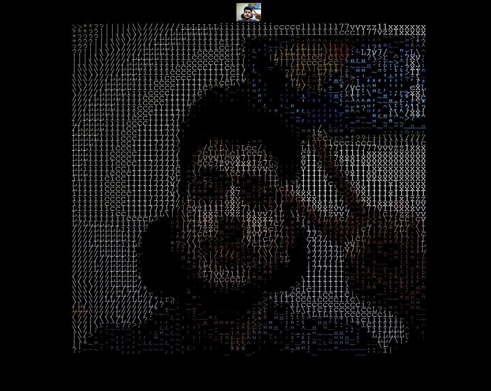

# video-to-ascii-art

Convert your webcam video into ASCII art! (this app is built with [Vite](https://vitejs.dev/) and [P5js](https://p5js.org/))

## screenshoot:



## Docs

- [Vite Docs](https://vitejs.dev/guide/)
- [P5js Docs](https://p5js.org/)

# Usage

## Development

To run your this app locally, make sure your project's local dependencies are installed:

```sh
yarn install
```

Afterwards, start the Vite development server like so:

```sh
yarn dev
```

## Build

To build the App, run

```sh
yarn build
```

And you will see the generated file in dist that ready to be served.
